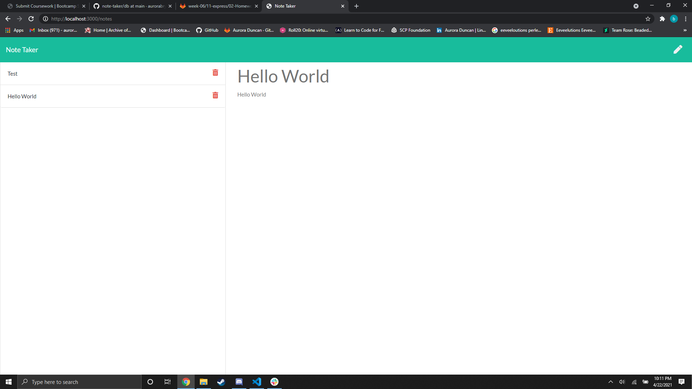

# Note Taker

## Description
I made a notebook app. Notes are very important to take in your day to day life, especially if you have a bad memory, like me. Notes can be taken for school, everyday life, or used for reminders. Having a notebook in digital form can be helpful so that you have access to it at all times.

I learned a lot about debuggers and how to set up breakpoints.

## Screenshot

## Link
<a href="https://aurorabrynn.github.io/note-taker/">Github Link</a>